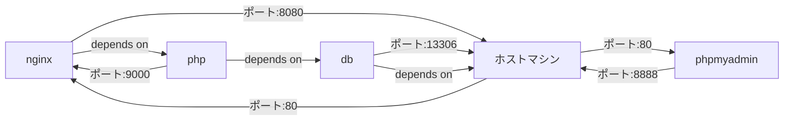

# php-docker-test

これは、Dockerを使用してPHPアプリケーションを開発する際のサンプルアプリケーションです。このアプリケーションは、Nginx、PHP、MySQL、およびphpMyAdminのコンテナーを含みます。

## 必要条件

- Dockerがインストールされていること

## 使用方法

1. このリポジトリをクローンします。

2. `docker-compose.yml`ファイルを開き、適切な設定を行います。

3. コマンドラインで以下のコマンドを入力します。

   ```
   docker-compose up -d
   ```

4. ブラウザで`localhost:8080`にアクセスし、アプリケーションを開始します。

## コンテナーの詳細

### nginx

このコンテナーは、Nginxウェブサーバーを実行します。`./nginx/nginx.conf`に記述された設定に従って構成されます。

#### ポート

- ホストポート: 8080
- コンテナーポート: 80

#### ボリューム

- `./nginx/nginx.conf:/etc/nginx/conf.d/default.conf`：構成ファイルをマウントします。
- `./www/html:/var/www/html`：ウェブサイトのファイルをマウントします。

#### 依存関係

- `php`：PHPコンテナーに依存します。

### php

このコンテナーは、PHPアプリケーションを実行します。`./php`内の`Dockerfile`に従って構築されます。

#### ボリューム

- `./www/html:/var/www/html`：ウェブサイトのファイルをマウントします。

#### 依存関係

- `db`：MySQLコンテナーに依存します。

### db

このコンテナーは、MySQLデータベースを実行します。

#### ポート

- ホストポート: 13306
- コンテナーポート: 3306

#### ボリューム

- `./mysql/data:/var/lib/mysql`：データベースファイルをマウントします。

#### 環境変数

- `MYSQL_ROOT_PASSWORD`：ルートアカウントのパスワードを設定します。

### phpmyadmin

このコンテナーは、phpMyAdminを実行します。

#### 環境変数

- `PMA_ARBITRARY`：任意のサーバーに接続できる許可を設定します。
- `PMA_HOST`：MySQLホスト名を指定します。
- `PMA_USER`：MySQLへの接続のためのユーザー名を設定します。
- `PMA_PASSWORD`：MySQLへの接続のためのパスワードを設定します。

#### ポート

- ホストポート: 8888
- コンテナーポート: 80

#### 依存関係

- `db`：MySQLコンテナーに依存します。

## ディレクトリの構成

```
php-docker-test/
├── README.md
├── docker-compose.yml
├── nginx/
│   └── nginx.conf
├── php/
│   ├── Dockerfile
│   └── php.ini
└── www/
    └── html/
        ├── db-txt/
        │   └── form-data.csv
        ├── db_connect.php
        ├── dir-check.php
        ├── index.php
        ├── inquiries.php
        ├── send-form.php
        ├── style/
        │   ├── inquiries.css
        │   ├── style.css
        │   └── thankyou.css
        └── thankyou.php
```

## 構成図

